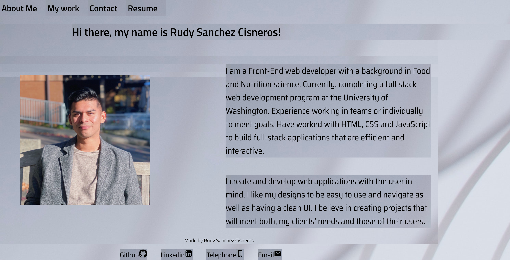
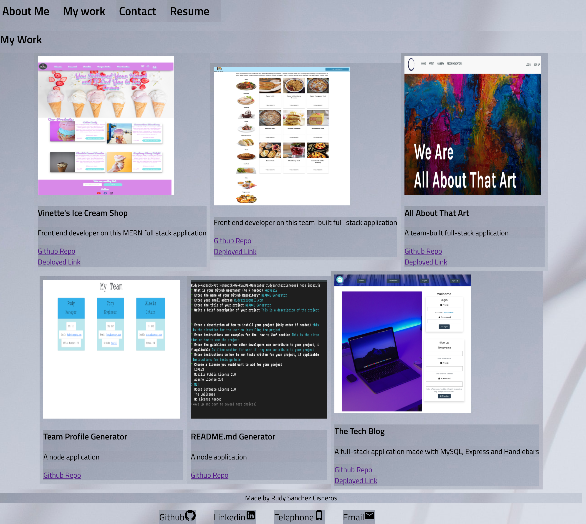
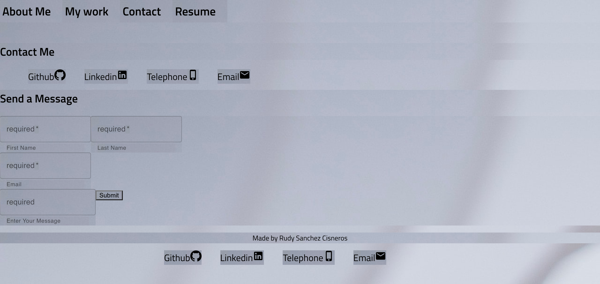
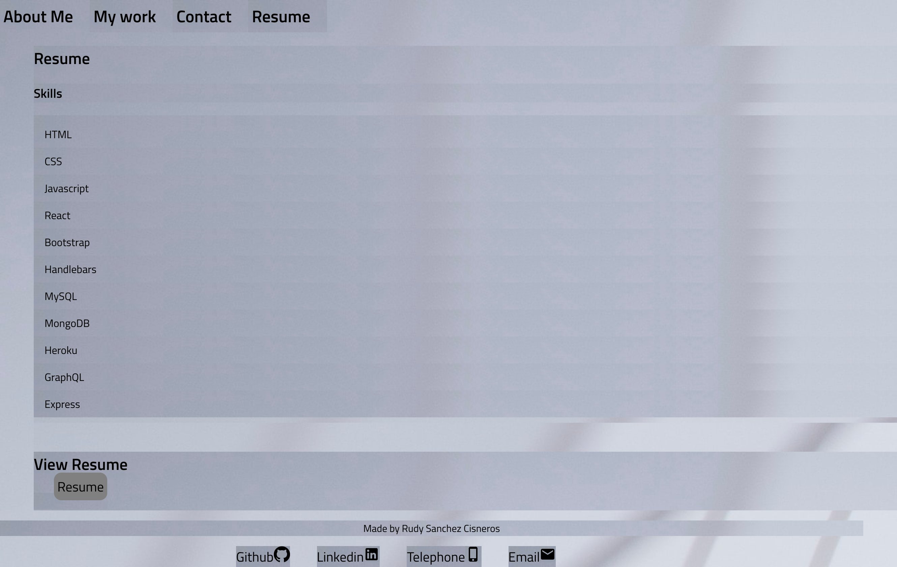

# Rsc-React-Portfolio

## Portfolio of my work

---

- Webpage displaying my information and the work I have completed to prospective employers or clients.
- This webpage will be used for showcasing my abilities and highlighting my strengths in my work.
## Built with

---
- Webpage was built with HTML,CSS, React, Material UI.

## How to Use
---

- The user can navigate the _About Me_ pg, _My Work_ pg, and the _Contact Me_ pg. Through using the navigation bar at the top of the page.
- The user can click on each image links in the _My work_ pg which would lead them to my work.
- The user can click on the hyperlinks in the _Contact Me_ pg to be redirected to my GitHub page, Linkedin page, or to reach out via phone or email! A message can also be submitted on this page.
- Resume page contains info on my skills and a link to view my resume.
---

- Header with navigations bar and about me section with current picture

  

- My Work page w/ Nav bar

  

- Contact me section

  

  -Resume section

  

## Submission

---

[GitHub Repo URL](https://github.com/Rudys212/rsc-react-portfolio)

[Deployed URL](https://rudys212.github.io/Rudy-S-Portfolio/)
